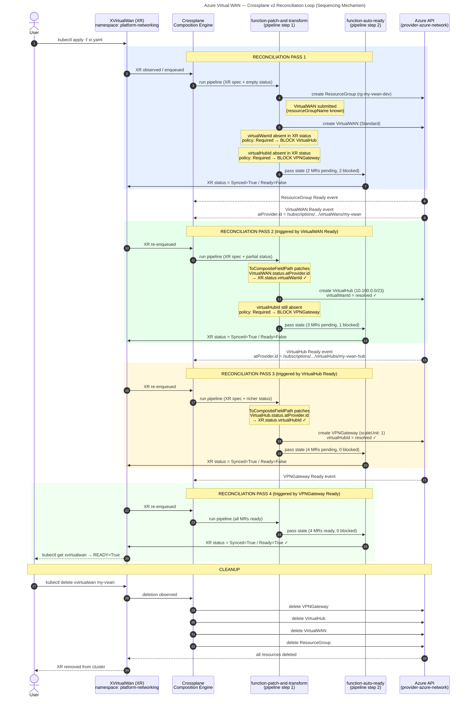

# Azure Virtual WAN — Crossplane v2 Sequencing Mechanism

This diagram shows the **reconciliation loop** that Crossplane uses to sequence the
provisioning of an Azure Virtual WAN topology.  It illustrates why
`policy.fromFieldPath: Required` in `function-patch-and-transform` is mandatory:
each resource depends on an Azure-assigned resource ID that only becomes available
*after* the parent resource has been fully provisioned by Azure.



## Key Observations

|Pass|What happens                                                                         |Gate released                       |
|----|-------------------------------------------------------------------------------------|------------------------------------|
|1   |`ResourceGroup` and `VirtualWAN` submitted; `VirtualHub` and `VPNGateway` **blocked**|—                                   |
|2   |`VirtualWAN` Azure ID written to XR status; `VirtualHub` **unblocked**               |`policy: Required` on `virtualWanId`|
|3   |`VirtualHub` Azure ID written to XR status; `VPNGateway` **unblocked**               |`policy: Required` on `virtualHubId`|
|4   |All 4 MRs ready; `function-auto-ready` marks XR `Ready=True`                         |—                                   |

## The Critical Patches

```yaml
# On VirtualWAN — writes Azure ID up to XR status
- type: ToCompositeFieldPath
  fromFieldPath: status.atProvider.id
  toFieldPath: status.virtualWanId

# On VirtualHub — reads that ID, blocks if absent
- type: FromCompositeFieldPath
  fromFieldPath: status.virtualWanId
  toFieldPath: spec.forProvider.virtualWanId
  policy:
    fromFieldPath: Required   # ← converts a failure into a controlled wait
```

Without `policy.fromFieldPath: Required` Crossplane would submit `VirtualHub` immediately
with an empty `virtualWanId`, the Azure API would reject it, and the composition would
enter a permanent error state instead of patiently sequencing through the dependency chain.

## References

- [Lab 04 — Azure Virtual WAN Composition](../docs/09-handson/lab-04-azure-virtual-wan.md)
- [Azure Virtual WAN Network Topology Diagram](./azure-virtual-wan-topology.svg)
- [function-patch-and-transform — fromFieldPath policy](https://github.com/crossplane-contrib/function-patch-and-transform#policy)
- [Crossplane — Composition Pipeline Mode](https://docs.crossplane.io/latest/concepts/compositions/)
