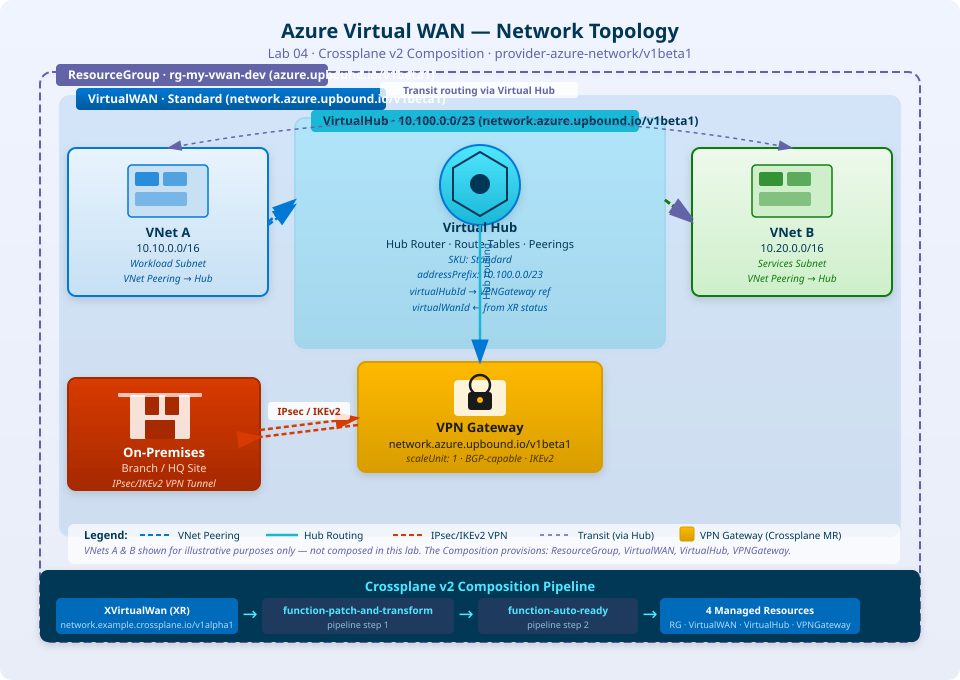

# Lab 04 — Azure Virtual WAN Composition

## References

- [Azure Virtual WAN with Crossplane v2](https://notebooklm.google.com/notebook/b895fe50-6507-4e19-b728-4eeecc44ee80)

## Overview

In this lab you will build a **Crossplane v2** composition for an **Azure Virtual WAN** topology.  
You will create:

|Object                                   |Purpose                                                                   |
|-----------------------------------------|--------------------------------------------------------------------------|
|`Function` (function-patch-and-transform)|Enables pipeline-mode patching                                            |
|`Function` (function-auto-ready)         |Marks the XR ready when all composed resources are ready                  |
|`CompositeResourceDefinition` (XRD)      |Defines the `XVirtualWan` API — **Namespaced**, no Claims                 |
|`Composition`                            |Provisions a `ResourceGroup`, `VirtualWAN`, `VirtualHub`, and `VPNGateway`|
|`XVirtualWan` (XR)                       |An instance of the composite resource                                     |

## Network Topology

The diagram below illustrates the Azure Virtual WAN topology that this lab provisions and the Crossplane v2 pipeline that drives it.



> The diagram source is also available as a Mermaid file at [`diagrams/azure-virtual-wan-topology.mermaid`](../../diagrams/azure-virtual-wan-topology.mermaid) for editing in tools that support Mermaid natively.

---

> **Crossplane v2 key differences used here**
> 
> - XRD `spec.scope: Namespaced` — the XR lives in a namespace, not cluster-wide.
> - No `claimNames` block — Claims are removed in v2.
> - Compositions use `mode: Pipeline` with an ordered list of Functions.

-----

## Prerequisites

- A running Kubernetes cluster with Crossplane v2 installed.
- The `upbound/provider-azure-network` and `upbound/provider-azure` providers installed and a `ProviderConfig` named `default` configured with valid Azure credentials.
- `kubectl` configured to talk to the cluster.

-----

## Step 1 — Install Required Functions

Crossplane v2 Compositions run as a **pipeline** of Functions.  
Install the two Functions needed for this lab.

```yaml
# functions.yaml
---
apiVersion: pkg.crossplane.io/v1beta1
kind: Function
metadata:
  name: function-patch-and-transform
spec:
  package: xpkg.upbound.io/crossplane-contrib/function-patch-and-transform:v0.8.0
---
apiVersion: pkg.crossplane.io/v1beta1
kind: Function
metadata:
  name: function-auto-ready
spec:
  package: xpkg.upbound.io/crossplane-contrib/function-auto-ready:v0.3.0
```

Apply:

```bash
kubectl apply -f functions.yaml
```

Wait until both Functions are healthy:

```bash
kubectl get function
# NAME                              INSTALLED   HEALTHY   PACKAGE                                                                    AGE
# function-auto-ready               True        True      xpkg.upbound.io/crossplane-contrib/function-auto-ready:v0.3.0             ...
# function-patch-and-transform      True        True      xpkg.upbound.io/crossplane-contrib/function-patch-and-transform:v0.8.0    ...
```

-----

## Step 2 — Create the CompositeResourceDefinition (XRD)

The XRD defines the schema for `XVirtualWan`.  
Key attributes:

- `spec.scope: Namespaced` — instances live in a namespace (Crossplane v2 behaviour).
- No `claimNames` — Claims are not used.
- Parameters exposed to the consumer: `location`, `resourceGroupName`, `hubAddressPrefix`, `wanType`, and `vpnGatewayScaleUnit`.

```yaml
# xrd.yaml
apiVersion: apiextensions.crossplane.io/v2
kind: CompositeResourceDefinition
metadata:
  name: xvirtualwans.network.example.crossplane.io
spec:
  scope: Namespaced
  group: network.example.crossplane.io
  names:
    kind: XVirtualWan
    plural: xvirtualwans
  versions:
    - name: v1alpha1
      served: true
      referenceable: true
      schema:
        openAPIV3Schema:
          type: object
          properties:
            spec:
              type: object
              properties:
                parameters:
                  type: object
                  required:
                    - location
                    - resourceGroupName
                    - hubAddressPrefix
                  properties:
                    location:
                      type: string
                      description: |
                        Azure region where all resources will be deployed,
                        e.g. "West Europe".
                    resourceGroupName:
                      type: string
                      description: |
                        Name of the Azure Resource Group to create.
                    wanType:
                      type: string
                      description: |
                        Virtual WAN SKU. Allowed values: Basic, Standard.
                        Defaults to Standard.
                      default: Standard
                      enum:
                        - Basic
                        - Standard
                    hubAddressPrefix:
                      type: string
                      description: |
                        Address prefix (CIDR) for the Virtual Hub,
                        e.g. "10.0.0.0/23".
                    vpnGatewayScaleUnit:
                      type: integer
                      description: |
                        Scale unit for the VPN Gateway. Defaults to 1.
                      default: 1
                      minimum: 1
                      maximum: 10
                    tags:
                      type: object
                      description: Optional key/value tags applied to all resources.
                      additionalProperties:
                        type: string
              required:
                - parameters
            status:
              type: object
              properties:
                virtualWanId:
                  type: string
                  description: Azure resource ID of the provisioned Virtual WAN.
                virtualHubId:
                  type: string
                  description: Azure resource ID of the provisioned Virtual Hub.
```

Apply:

```bash
kubectl apply -f xrd.yaml
```

Verify the XRD is established:

```bash
kubectl get compositeresourcedefinition xvirtualwans.network.example.crossplane.io
# NAME                                            ESTABLISHED   OFFERED   AGE
# xvirtualwans.network.example.crossplane.io      True          False     ...
```

> **Note:** `OFFERED` is `False` because no Claims are defined — this is expected in Crossplane v2 when Claims are not used.

-----

## Step 3 — Create the Composition

The Composition wires together four Azure managed resources in a pipeline.  
Crossplane v2 requires `mode: Pipeline`; the classic `resources` list is no longer the primary approach.

```yaml
# composition.yaml
apiVersion: apiextensions.crossplane.io/v1
kind: Composition
metadata:
  name: xvirtualwans.network.example.crossplane.io
  labels:
    provider: azure
    service: virtual-wan
spec:
  compositeTypeRef:
    apiVersion: network.example.crossplane.io/v1alpha1
    kind: XVirtualWan

  mode: Pipeline

  pipeline:
    # ── Step 1: patch-and-transform ──────────────────────────────────────────
    - step: patch-and-transform
      functionRef:
        name: function-patch-and-transform
      input:
        apiVersion: pt.fn.crossplane.io/v1beta1
        kind: Resources
        resources:

          # ── Resource Group ─────────────────────────────────────────────────
          - name: resource-group
            base:
              apiVersion: azure.upbound.io/v1beta1
              kind: ResourceGroup
              spec:
                forProvider:
                  location: West Europe
                providerConfigRef:
                  name: default
            patches:
              - type: FromCompositeFieldPath
                fromFieldPath: spec.parameters.location
                toFieldPath: spec.forProvider.location
              - type: FromCompositeFieldPath
                fromFieldPath: spec.parameters.resourceGroupName
                toFieldPath: metadata.name
              - type: FromCompositeFieldPath
                fromFieldPath: spec.parameters.tags
                toFieldPath: spec.forProvider.tags

          # ── Virtual WAN ────────────────────────────────────────────────────
          - name: virtual-wan
            base:
              apiVersion: network.azure.upbound.io/v1beta1
              kind: VirtualWAN
              spec:
                forProvider:
                  location: West Europe
                  type: Standard
                  disableVpnEncryption: false
                  allowBranchToBranchTraffic: true
                providerConfigRef:
                  name: default
            patches:
              - type: FromCompositeFieldPath
                fromFieldPath: spec.parameters.location
                toFieldPath: spec.forProvider.location
              - type: FromCompositeFieldPath
                fromFieldPath: spec.parameters.resourceGroupName
                toFieldPath: spec.forProvider.resourceGroupName
              - type: FromCompositeFieldPath
                fromFieldPath: spec.parameters.wanType
                toFieldPath: spec.forProvider.type
              - type: FromCompositeFieldPath
                fromFieldPath: spec.parameters.tags
                toFieldPath: spec.forProvider.tags
              # Write the VirtualWAN Azure ID back to XR status
              - type: ToCompositeFieldPath
                fromFieldPath: status.atProvider.id
                toFieldPath: status.virtualWanId

          # ── Virtual Hub ────────────────────────────────────────────────────
          - name: virtual-hub
            base:
              apiVersion: network.azure.upbound.io/v1beta1
              kind: VirtualHub
              spec:
                forProvider:
                  location: West Europe
                  addressPrefix: 10.0.0.0/23
                  sku: Standard
                providerConfigRef:
                  name: default
            patches:
              - type: FromCompositeFieldPath
                fromFieldPath: spec.parameters.location
                toFieldPath: spec.forProvider.location
              - type: FromCompositeFieldPath
                fromFieldPath: spec.parameters.resourceGroupName
                toFieldPath: spec.forProvider.resourceGroupName
              - type: FromCompositeFieldPath
                fromFieldPath: spec.parameters.hubAddressPrefix
                toFieldPath: spec.forProvider.addressPrefix
              # Reference the Virtual WAN created above
              - type: FromCompositeFieldPath
                fromFieldPath: status.virtualWanId
                toFieldPath: spec.forProvider.virtualWanId
                policy:
                  fromFieldPath: Required
              - type: FromCompositeFieldPath
                fromFieldPath: spec.parameters.tags
                toFieldPath: spec.forProvider.tags
              # Write the VirtualHub Azure ID back to XR status
              - type: ToCompositeFieldPath
                fromFieldPath: status.atProvider.id
                toFieldPath: status.virtualHubId

          # ── VPN Gateway ────────────────────────────────────────────────────
          - name: vpn-gateway
            base:
              apiVersion: network.azure.upbound.io/v1beta1
              kind: VPNGateway
              spec:
                forProvider:
                  location: West Europe
                  scaleUnit: 1
                providerConfigRef:
                  name: default
            patches:
              - type: FromCompositeFieldPath
                fromFieldPath: spec.parameters.location
                toFieldPath: spec.forProvider.location
              - type: FromCompositeFieldPath
                fromFieldPath: spec.parameters.resourceGroupName
                toFieldPath: spec.forProvider.resourceGroupName
              - type: FromCompositeFieldPath
                fromFieldPath: spec.parameters.vpnGatewayScaleUnit
                toFieldPath: spec.forProvider.scaleUnit
              # Reference the Virtual Hub created above
              - type: FromCompositeFieldPath
                fromFieldPath: status.virtualHubId
                toFieldPath: spec.forProvider.virtualHubId
                policy:
                  fromFieldPath: Required
              - type: FromCompositeFieldPath
                fromFieldPath: spec.parameters.tags
                toFieldPath: spec.forProvider.tags

    # ── Step 2: auto-ready ───────────────────────────────────────────────────
    - step: auto-ready
      functionRef:
        name: function-auto-ready
```

Apply:

```bash
kubectl apply -f composition.yaml
```

Verify:

```bash
kubectl get composition xvirtualwans.network.example.crossplane.io
# NAME                                            XR-KIND        XR-APIVERSION                               AGE
# xvirtualwans.network.example.crossplane.io      XVirtualWan    network.example.crossplane.io/v1alpha1      ...
```

-----

## Step 4 — Create the Composite Resource (XR)

With `scope: Namespaced` the XR is created inside a namespace.  
Create a dedicated namespace first.

```bash
kubectl create namespace platform-networking
```

```yaml
# xr.yaml
apiVersion: network.example.crossplane.io/v1alpha1
kind: XVirtualWan
metadata:
  name: my-vwan
  namespace: platform-networking
spec:
  compositionRef:
    name: xvirtualwans.network.example.crossplane.io
  parameters:
    location: West Europe
    resourceGroupName: rg-my-vwan-dev
    wanType: Standard
    hubAddressPrefix: "10.100.0.0/23"
    vpnGatewayScaleUnit: 1
    tags:
      environment: dev
      managedBy: crossplane
      project: atlas-idp
```

Apply:

```bash
kubectl apply -f xr.yaml
```

-----

## Step 5 — Observe the Deployment

Watch the XR progress:

```bash
kubectl get xvirtualwan my-vwan -n platform-networking -w
# NAME       SYNCED   READY   COMPOSITION                                         AGE
# my-vwan    True     False   xvirtualwans.network.example.crossplane.io          30s
# my-vwan    True     True    xvirtualwans.network.example.crossplane.io          12m
```

> **Note:** A Virtual WAN topology with a VPN Gateway can take **10–20 minutes** to provision in Azure.

Inspect all composed resources created by the XR:

```bash
kubectl get managed -l crossplane.io/composite=my-vwan
# NAME                    SYNCED   READY   EXTERNAL-NAME   AGE
# resourcegroup/...       True     True    rg-my-vwan-dev  12m
# virtualwan/...          True     True    my-vwan-...     11m
# virtualhub/...          True     True    my-vwan-hub-... 10m
# vpngateway/...          True     True    my-vwan-vpngw-  8m
```

Inspect the XR status fields written by the composition:

```bash
kubectl describe xvirtualwan my-vwan -n platform-networking
# ...
# Status:
#   Virtual Hub Id:  /subscriptions/.../resourceGroups/rg-my-vwan-dev/providers/Microsoft.Network/virtualHubs/...
#   Virtual Wan Id:  /subscriptions/.../resourceGroups/rg-my-vwan-dev/providers/Microsoft.Network/virtualWans/...
```

-----

## Step 6 — Cleanup

Delete the XR; Crossplane will cascade-delete all composed managed resources:

```bash
kubectl delete xvirtualwan my-vwan -n platform-networking
```

Verify all composed resources are gone:

```bash
kubectl get managed -l crossplane.io/composite=my-vwan
# No resources found.
```

-----

## Summary

In this lab you:

1. Installed the `function-patch-and-transform` and `function-auto-ready` Functions required by Crossplane v2 pipeline-mode Compositions.
1. Defined an `XRD` with `scope: Namespaced` and no Claims — the Crossplane v2 pattern.
1. Created a `Composition` in `mode: Pipeline` that provisions a full Azure Virtual WAN topology (ResourceGroup → VirtualWAN → VirtualHub → VPNGateway) using the Upbound Azure provider.
1. Applied an `XVirtualWan` XR in a namespace and observed Crossplane reconcile all four Azure resources automatically.
1. Demonstrated cascade deletion via the XR.

### Key Concepts Reinforced

|Concept                  |Detail                                                                                |
|-------------------------|--------------------------------------------------------------------------------------|
|XRD `scope: Namespaced`  |XR instances are namespace-scoped; no cluster-scoped XR in v2                         |
|No Claims                |`claimNames` omitted — consumers interact with the XR directly                        |
|`mode: Pipeline`         |Required in Crossplane v2; replaces the `resources` list approach                     |
|Function ordering        |`function-patch-and-transform` runs first, then `function-auto-ready`                 |
|Status writeback         |`ToCompositeFieldPath` is used to propagate Azure IDs back to XR status               |
|Cross-resource references|VirtualHub references VirtualWAN ID via XR status; VPNGateway references VirtualHub ID|

-----

## References

- [Crossplane v2 XRD API Reference](https://docs.crossplane.io/latest/concepts/composite-resource-definitions/)
- [Crossplane Composition Pipeline Mode](https://docs.crossplane.io/latest/concepts/compositions/)
- [function-patch-and-transform](https://github.com/crossplane-contrib/function-patch-and-transform)
- [function-auto-ready](https://github.com/crossplane-contrib/function-auto-ready)
- [Upbound provider-azure-network — VirtualWAN](https://marketplace.upbound.io/providers/upbound/provider-azure-network/latest/resources/network.azure.upbound.io/VirtualWAN/v1beta1)
- [Upbound provider-azure-network — VirtualHub](https://marketplace.upbound.io/providers/upbound/provider-azure-network/latest/resources/network.azure.upbound.io/VirtualHub/v1beta1)
- [Upbound provider-azure-network — VPNGateway](https://marketplace.upbound.io/providers/upbound/provider-azure-network/latest/resources/network.azure.upbound.io/VPNGateway/v1beta1)
